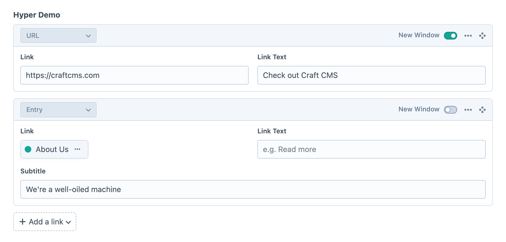
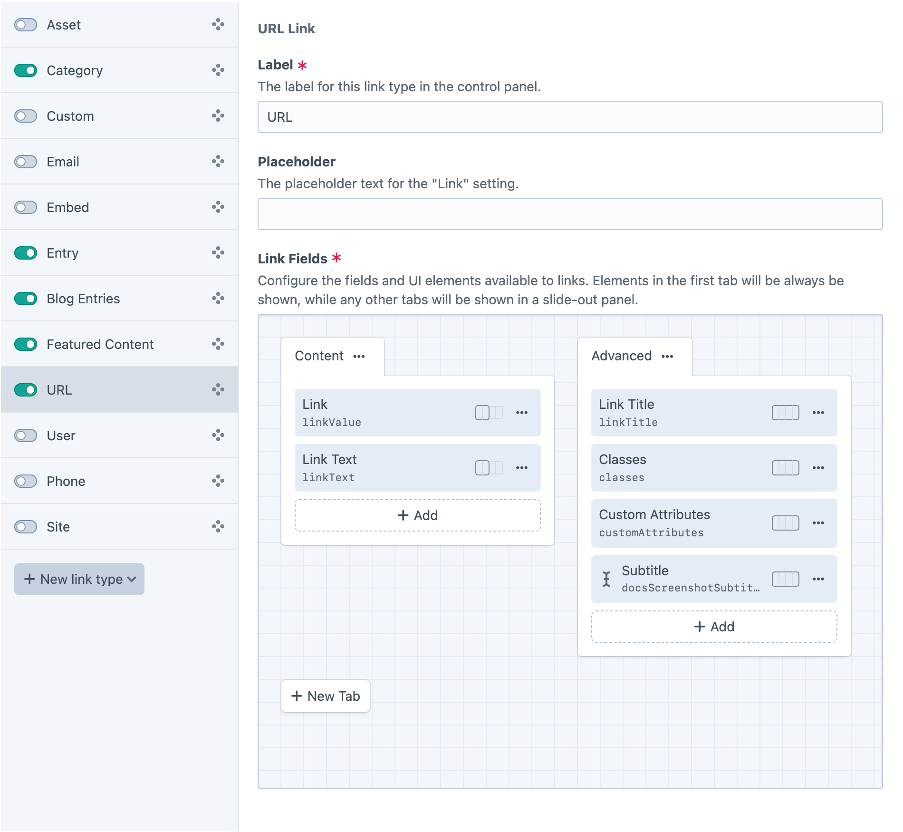
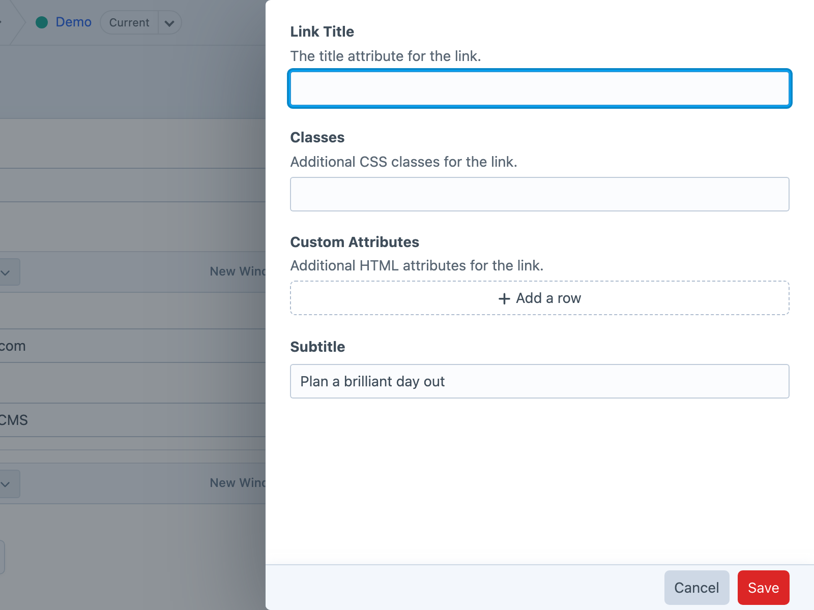

<!-- feature-intro -->
A user-friendly field for creating single links or collections of links to URLs, emails, Craft elements and more.
<!-- feature-intro-end -->

<!-- feature-section media-size="large" media-shadow="false" -->
## Single or multi

Configure Hyper for one focused destination or a sortable collection. Authors get the same link-picking workflow in either mode, with multi-link fields keeping destinations in the order the page needs.

<!-- feature-section-end -->

<!-- feature-section -->
## Multiple link types

Let authors link to entries, assets, categories, users, products and other native Craft elements, or enter URLs, email addresses, phone numbers and embedded content. Create several link types for specific needs while keeping one predictable editing and template API.

<!-- feature-section-end -->

<!-- feature-section -->
## Ultimate flexibility with fields

Arrange native or custom fields with Craft’s field layout designer so each link can carry the supporting content the project needs. Keep the field compact when a destination is enough, or build a structured call to action with additional authoring controls.

<!-- feature-section-end -->

<!-- feature-grid -->
- :icon[braces] **Predictable templates** Render links directly or access normalised link data from Twig.
- :icon[api] **GraphQL** Query Hyper fields alongside entries and other elements in a headless build.
- :icon[file-import] **Feed Me** Import link content through established [Feed Me](https://plugins.craftcms.com/feed-me) workflows.
- :icon[bolt] **A focus on performance** Hyper minimises and groups element queries when links are used throughout a page.
<!-- feature-grid-end -->

<!-- feature-section -->
## Practical migrations

Migration helpers cover common Craft link fields, including the first-party Link field and several established third-party fields. That makes adopting Hyper practical on existing projects as well as new builds.
<!-- feature-section-end -->
